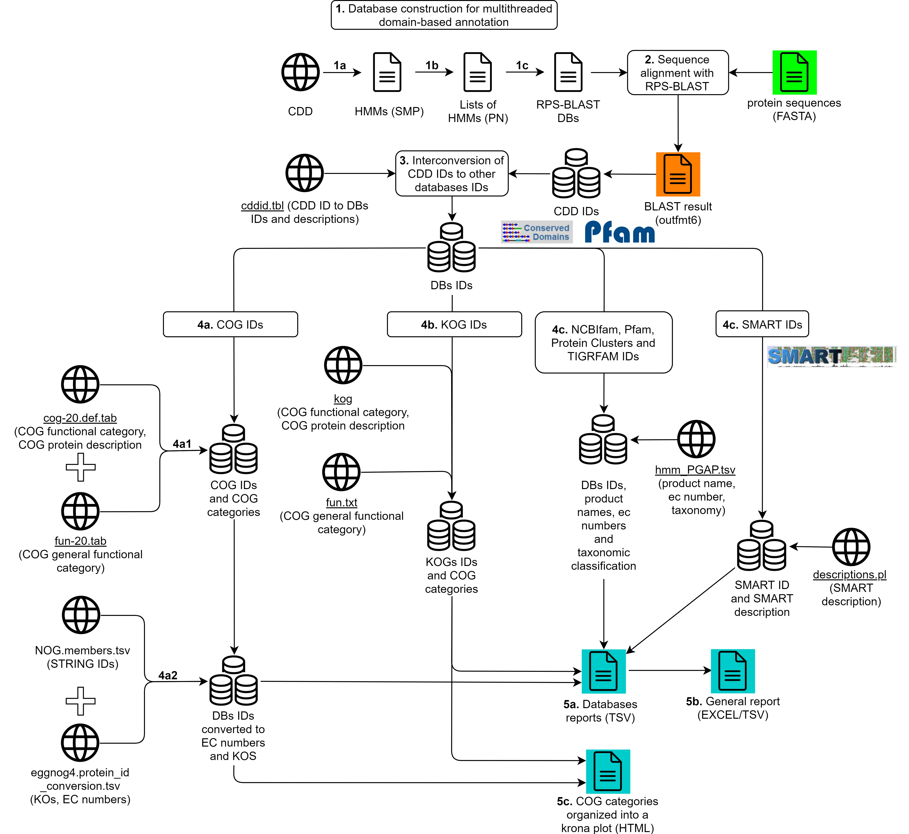

# reCOGnizer

A tool for domain based annotation with databases from the [Conserved Domains Database](https://www.ncbi.nlm.nih.gov/Structure/cdd/cdd.shtml).

* [Features](https://github.com/iquasere/reCOGnizer#features)
* [Installing reCOGnizer](https://github.com/iquasere/reCOGnizer#installing-recognizer)
* [Annotation with reCOGnizer](https://github.com/iquasere/reCOGnizer#annotation-with-recognizer)
* [Output](https://github.com/iquasere/reCOGnizer#output)
* [Other parameters](https://github.com/iquasere/reCOGnizer#other-parameters)
* [Referencing reCOGnizer](https://github.com/iquasere/reCOGnizer#referencing-recognizer)


## Features

reCOGnizer performs domain-based annotation with RPS-BLAST and databases from CDD as reference.
* Reference databases currently implemented: CDD, NCBIfam, Pfam, TIGRFAM, Protein Clusters, SMART, COG and KOG.
* reCOGnizer builds split versions of these databases with which RPS-BLAST can run in multithread, significantly increasing the speed of annotation.
* After domain assignment to proteins, reCOGnizer converts CDD IDs to the IDs of the respective DBs, and obtains domain descriptions available at CDD.
* Further information is retrieved depending on the database in question:
    * NCBIfam, Pfam, TIGRFAM and Protein Clusters annotations are complemented with taxonomic classifications and EC numbers
    * SMART annotations are complemented with SMART descriptions
    * COG and KOG annotations are complemented with COG categories and EC numbers and KEGG Orthologs (for COG)

A detailed representation of reCOGnizer's workflow is presented in Fig. 1.


Fig. 1. Workflow of reGOGnizer, which includes the pre-analysis step of constructing databases, the domain-based annotation of inputted protein sequences, the interconversion of CDD IDs to other databases IDs, the ID mapping through several databases for obtaining information about the obtained IDs, and the output of information into TSV, Excel and HTML reports.

## Installing reCOGnizer

To install reCOGnizer, clone this repository and run the install script:
```
git clone https://github.com/iquasere/reCOGnizer.git
sudo reCOGnizer/install.bash
```

### With Bioconda

reCOGnizer can also be installed with Conda! Many thanks to [Devon Ryan](https://github.com/dpryan79) for his precious help!

Install:  ```conda install -c conda-forge -c bioconda recognizer```

Test installation: ```recognizer.py -v```

**Warning:** running with Conda is better performed using the -rd parameter to store the databases and other resources in a directory of your choice. Doing so will prevent reCOGnizer from putting these files in unexpected locations.

## Annotation with reCOGnizer

The simplest way to run reCOGnizer is to just specify the fasta filename and an output directory - though even the output directory is not mandatory. It is recommended that a "resources" directory is specified to store the databases that reCOGnizer requires.
```
recognizer.py -f input_file.fasta -o recognizer_output -rd resources_directory
```

## Output

reCOGnizer takes a FASTA file as input and produces two main outputs into the output directory:
* ```reCOGnizer_results.tsv```, a table with the annotations for each protein
* ```cog_quantification``` and respective Krona representation (Fig. 2), which describes the functional landscape of the proteins in the input file


Fig. 2. Krona plot with the quantification of COGs identified in the simulated dataset used to test [MOSCA](github.com/iquasere/MOSCA) and reCOGnizer.

## Other parameters

```
usage: recognizer.py [-h] [-t THREADS] [-o OUTPUT] [-rd RESOURCES_DIRECTORY]
                     [-db DATABASE] [--custom-database]
                     [-seqs MAX_TARGET_SEQS] [--tsv] [--remove-spaces]
                     [--no-output-sequences] [--no-blast-info] [-v] -f FILE

reCOGnizer - a tool for domain based annotation with the COG database

optional arguments:
  -h, --help            show this help message and exit
  -t THREADS, --threads THREADS
                        Number of threads for reCOGnizer to use. Default is
                        number of CPUs available minus 2.
  -o OUTPUT, --output OUTPUT
                        Output directory
  -rd RESOURCES_DIRECTORY, --resources-directory RESOURCES_DIRECTORY
                        Output directory for storing COG databases and other
                        resources
  -db DATABASE, --database DATABASE
                        Basename of COG database for annotation. If multiple
                        databases, use comma separated list (db1,db2,db3)
  --custom-database     If database was NOT produced by reCOGnizer
  -seqs MAX_TARGET_SEQS, --max-target-seqs MAX_TARGET_SEQS
                        Number of maximum identifications for each protein.
                        Default is 1.
  --tsv                 Tables will be produced in TSV format (and not EXCEL).
  --remove-spaces       BLAST ignores sequences IDs after the first space.
                        This option changes all spaces to underscores to keep
                        the full IDs.
  --no-output-sequences
                        Protein sequences from the FASTA input will be stored
                        in their own column.
  --no-blast-info       Information from the alignment will be stored in their
                        own columns.
  -v, --version         show program's version number and exit

required named arguments:
  -f FILE, --file FILE  Fasta file with protein sequences for annotation
```

## Referencing reCOGnizer

If you use reCOGnizer, please cite its [publication](https://www.sciencedirect.com/science/article/pii/S2001037022001179).