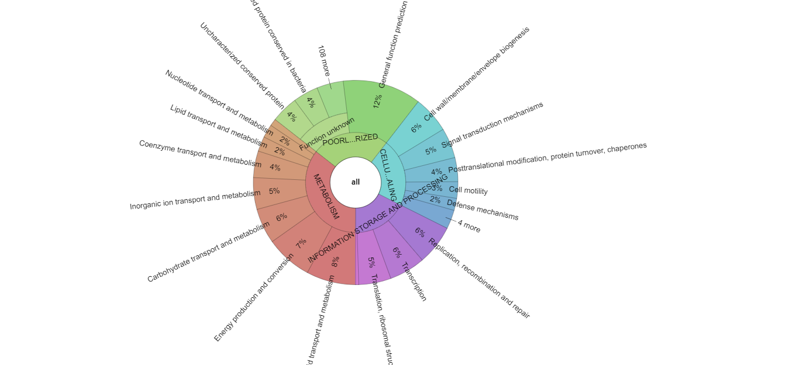

# reCOGnizer

A tool for domain based annotation with the COG database.

## Features

reCOGnizer is a user-friendly implementation of protein functional identification using COG database. 
* It builds a split version of the COG database with which RPS-BLAST can run in multithread, significantly increasing the speed of the most time intensive step of protein annotation. 
* After COG assignment to proteins, reCOGnizer converts CDD IDs to their respective COGs, before organizing those COGs into a relational table of protein to COG, with the inclusion of the three levels of functional classification from COG. 
* reCOGnizer further converts assigned COG functions to EC numbers, providing more functional information.

## Installation

To install reCOGnizer, simply clone this repository and run install.bash!
```
git clone https://github.com/iquasere/reCOGnizer.git
sudo reCOGnizer/install.bash
```

## Usage

reCOGnizer needs an input file, but that is all it needs!
```
usage: recognizer.py [-h] [-t THREADS] [-o OUTPUT] [-rd RESOURCES_DIRECTORY]
                     [-db DATABASE] [--custom-database]
                     [-seqs MAX_TARGET_SEQS] [--tsv] [--remove-spaces]
                     [--keep-sequences] [-v] -f FILE

reCOGnizer - a tool for domain based annotation with the COG database

optional arguments:
  -h, --help            show this help message and exit
  -t THREADS, --threads THREADS
                        Number of threads for reCOGnizer to use. Default is
                        number of CPUs available minus 2.
  -o OUTPUT, --output OUTPUT
                        Output directory
  -rd RESOURCES_DIRECTORY, --resources-directory RESOURCES_DIRECTORY
                        Output directory for storing COG databases and other
                        resources
  -db DATABASE, --database DATABASE
                        Basename of COG database for annotation. If multiple
                        databases, use comma separated list (db1,db2,db3)
  --custom-database     If database was NOT produced by reCOGnizer
  -seqs MAX_TARGET_SEQS, --max-target-seqs MAX_TARGET_SEQS
                        Number of maximum identifications for each protein.
                        Default is 1.
  --tsv                 Tables will be produced in TSV format (and not EXCEL).
  --remove-spaces       BLAST ignores sequences IDs after the first space.
                        This option changes all spaces to underscores to keep
                        the full IDs.
  --keep-sequences      Protein sequences from the FASTA input will be stored
                        in their own column. This produces considerably larger
                        files.
  -v, --version         show program's version number and exit

required named arguments:
  -f FILE, --file FILE  Fasta file with protein sequences for annotation
```

The simplest way to run reCOGnizer is to just specify the fasta filename and an output directory - though even the output directory is not mandatory.
```
python recognizer.py -f input_file.fasta -o output_folder
```

## Outputs

reCOGnizer takes a FASTA file as input and produces two main outputs into the output directory:
* protein2cog, a table relating assigned cogs to queried proteins
* cog_quantification and respective Krona representation, which describes the functional landscape of the proteins in the input file


Krona plot with the quantification of COGs identified in the simulated dataset used to test [MOSCA](github.com/iquasere/MOSCA) and reCOGnizer.

## Docker

reCOGnizer already has its own image! To use it, just pull the image and run it!
```
docker pull iquasere/recognizer:1.2.3
docker run -it -v absolute/path/to/fasta_folder:/input_folder /absolute/path/to/output_folder:/output_folder --rm iquasere/recognizer -f /input_folder/input_file.fasta -o /output_folder [other arguments]
```

## Bioconda

reCOGnizer can also be installed with Conda! Many thanks to [Devon Ryan](https://github.com/dpryan79) for his precious help!
```
conda install -c bioconda recognizer
recognizer.py -v
```
**Warning:** running with Conda is better performed using the -rd parameter to store the databases and other resources in a directory of your choice. Doing so will prevent reCOGnizer from putting these files in unexpected locations.