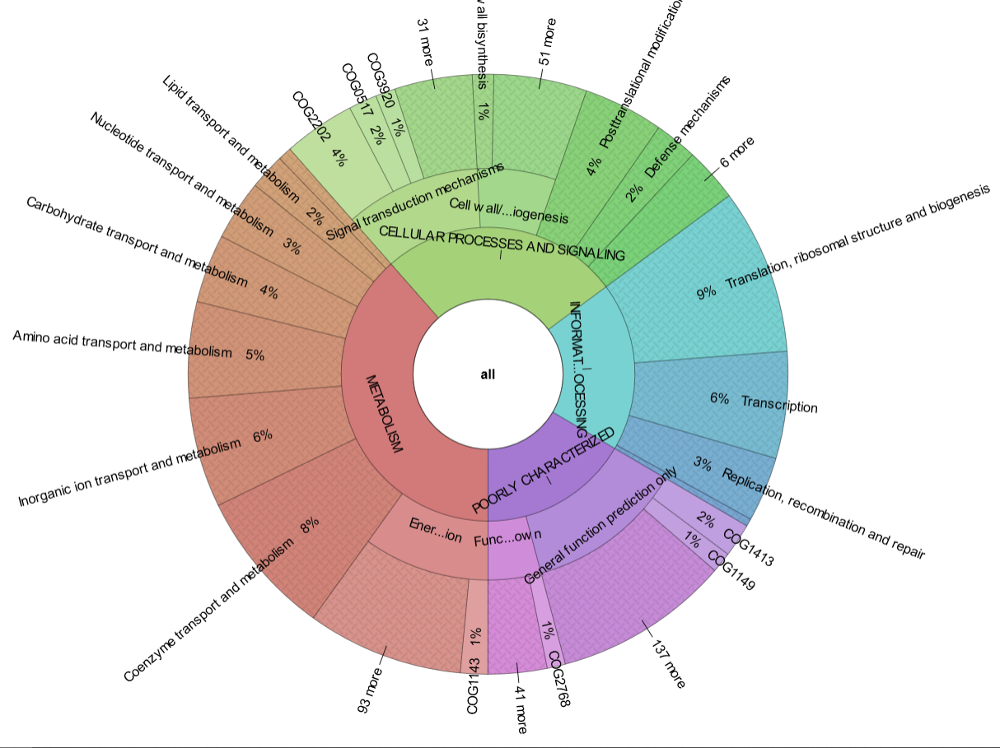

# reCOGnizer

A tool for domain-based annotation with databases from the [Conserved Domains Database](https://www.ncbi.nlm.nih.gov/Structure/cdd/cdd.shtml).

* [Features](https://github.com/iquasere/reCOGnizer#features)
* [Installing reCOGnizer](https://github.com/iquasere/reCOGnizer#installing-recognizer)
* [Annotation with reCOGnizer](https://github.com/iquasere/reCOGnizer#annotation-with-recognizer)
* [Output](https://github.com/iquasere/reCOGnizer#output)
* [Other parameters](https://github.com/iquasere/reCOGnizer#other-parameters)
* [Referencing reCOGnizer](https://github.com/iquasere/reCOGnizer#referencing-recognizer)


## Features

reCOGnizer performs domain-based annotation with RPS-BLAST and databases from CDD as reference.
* Reference databases currently implemented: CDD, NCBIfam, Pfam, TIGRFAM, Protein Clusters, SMART, COG and KOG.
* reCOGnizer performs multithread annotation with RPS-BLAST, significantly increasing the speed of annotation.
* After domain assignment to proteins, reCOGnizer converts CDD IDs to the IDs of the respective DBs, and obtains domain descriptions available at CDD.
* Further information is retrieved depending on the database in question:
    * NCBIfam, Pfam, TIGRFAM and Protein Clusters annotations are complemented with taxonomic classifications and EC numbers.
    * SMART annotations are complemented with SMART descriptions.
    * COG and KOG annotations are complemented with COG/KOG categories, EC numbers and KEGG Orthologs.

A detailed representation of reCOGnizer's workflow is presented in Fig. 1.

## Installing reCOGnizer

To install reCOGnizer, simply run: `conda install -c conda-forge -c bioconda recognizer`

## Annotation with reCOGnizer

The simplest way to run reCOGnizer is to just specify the fasta filename and an output directory - though even the output directory is not mandatory.
```
recognizer -f input_file.faa -o output_directory
```

## Output

reCOGnizer takes a FASTA file (of aminoacids, commonly either `.fasta` or `.faa`) as input and produces two main outputs into the output directory:
* ```reCOGnizer_results.tsv``` and ```reCOGnizer_results.xlsx```, tables with the annotations from every database for each protein
* ```cog_quantification.tsv``` and respective Krona representation (Fig. 2), which describes the functional landscape of the proteins in the input file

[](https://iquasere.github.io/reCOGnizer)

Fig. 2. Krona plot with the quantification of COGs identified in the simulated dataset used to test [MOSCA](https://github.com/iquasere/MOSCA) and reCOGnizer. Click in the plot to see the interactive version that is outputed by reCOGnizer.

## Using previously gathered taxonomic information

reCOGnizer can make use of taxonomic information by filtering Markov Models for the specific taxa of interest. 
This can be done by providing a file with the taxonomic information of the proteins.
To simulate this, run the following commands, after installing reCOGnizer:
```
git clone https://github.com/iquasere/reCOGnizer.git
cd reCOGnizer/ci
recognizer -f proteomes.fasta --f UPIMAPI_results.tsv --tax-col 'Taxonomic lineage IDs (SPECIES)' --protein-id-col qseqid --species-taxids
```
Running reCOGnizer this way will usually obtain better results, but will likely take much longer to finish.

## reCOGnizer parameters

```
options:
  -h, --help            show this help message and exit
  -f FILE, --file FILE  Fasta file with protein sequences for annotation
  -t THREADS, --threads THREADS
                        Number of threads for reCOGnizer to use [max available]
  --evalue EVALUE       Maximum e-value to report annotations for [1e-3]
  -o OUTPUT, --output OUTPUT
                        Output directory [reCOGnizer_results]
  -dr DOWNLOAD_RESOURCES, --download-resources DOWNLOAD_RESOURCES
                        This parameter is deprecated. Please do not use it [None]
  -rd RESOURCES_DIRECTORY, --resources-directory RESOURCES_DIRECTORY
                        Output directory for storing databases and other resources [~/recognizer_resources]
  -dbs DATABASES, --databases DATABASES
                        Databases to include in functional annotation (comma-separated) [all available]
  --custom-databases    If databases inputted were NOT produced by reCOGnizer [False]. Default databases of reCOGnizer (e.g., COG, TIGRFAM, ...) can't be used simultaneously with custom
                        databases. Use together with the '--databases' parameter.
  -mts MAX_TARGET_SEQS, --max-target-seqs MAX_TARGET_SEQS
                        Number of maximum identifications for each protein [1]
  --keep-spaces         BLAST ignores sequences IDs after the first space. This option changes all spaces to underscores to keep the full IDs.
  --no-output-sequences
                        Protein sequences from the FASTA input will be stored in their own column.
  --no-blast-info       Information from the alignment will be stored in their own columns.
  --output-rpsbproc-cols
                        Output columns obtained with RPSBPROC - 'Superfamilies', 'Sites' and 'Motifs'.
  -sd SKIP_DOWNLOADED, --skip-downloaded SKIP_DOWNLOADED
                        This parameter is deprecated. Please do not use it [None]
  --keep-intermediates  Keep intermediate annotation files generated in reCOGnizer's workflow, i.e., ASN, RPSBPROC and BLAST reports and split FASTA inputs.
  --quiet               Don't output download information, used mainly for CI.
  --debug               Print all commands running in the background, including those of rpsblast and rpsbproc.
  --test-run            This parameter is only appropriate for reCOGnizer's tests on GitHub. Should not be used.
  -v, --version         show program's version number and exit

Taxonomy Arguments:
  --tax-file TAX_FILE   File with taxonomic identification of proteins inputted (TSV). Must have one line per query, query name on first column, taxid on second.
  --protein-id-col PROTEIN_ID_COL
                        Name of column with protein headers as in supplied FASTA file [qseqid]
  --tax-col TAX_COL     Name of column with tax IDs of proteins [Taxonomic identifier (SPECIES)]
  --species-taxids      If tax col contains Tax IDs of species (required for running COG taxonomic)
```

## Referencing reCOGnizer

If you use reCOGnizer, please cite its [publication](https://www.sciencedirect.com/science/article/pii/S2001037022001179).
